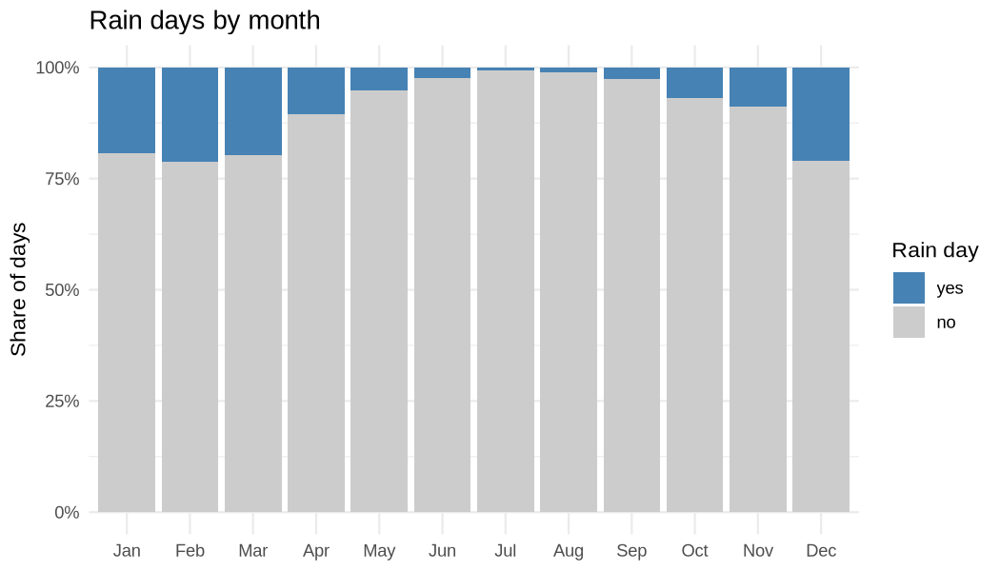
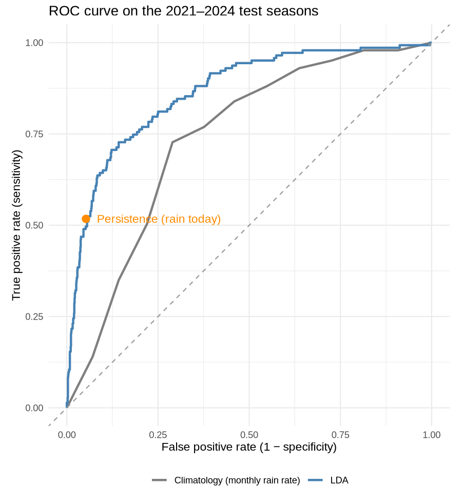

# Santa Barbara Rainfall Prediction

[](https://github.com/IcedLimes/sb-rainfall-prediction/actions/workflows/tests.yml)

A machine learning model that predicts whether it will rain **tomorrow** at Santa Barbara Municipal Airport, using today's weather observations. The project is built in R with [tidymodels](https://www.tidymodels.org/) on nearly 19 years of NOAA daily weather data (2006–2024). It compares four classifiers (logistic regression, linear and quadratic discriminant analysis, and k-nearest neighbours) against simple forecasting rules.

**[Read the full report →](https://IcedLimes.github.io/sb-rainfall-prediction/)**

## The problem

Santa Barbara has a Mediterranean climate: rain falls on only about 1 day in 10, and three-quarters of those rain days come between November and March. That imbalance makes the problem harder than it looks. A model that always predicts "no rain" is about 90% accurate and useless, so models are judged on ROC AUC and precision–recall AUC instead of accuracy.



## Data

Daily summaries from NOAA's Global Historical Climatology Network (station `USW00023190`), January 2006 to September 2024: precipitation, maximum and minimum temperature, average wind speed, and maximum and minimum relative humidity. See [`data/README.md`](data/README.md) for units, the download link and known data-quality issues.

## Approach

**Features.** Each row is one day. The predictors are that day's temperatures, wind, humidity, whether it rained and how much, and the day of the year (as a sine/cosine pair so that December and January sit next to each other). The outcome is whether it rains the *next* calendar day. Days are matched by date, not row order, so gaps in the record can't pair a day with the wrong "tomorrow".

**Validation.** Weather on neighbouring days is strongly related, so a random train/test split would leak information. The data are split by *water year* (October–September, one rainy season each) instead:

- **Training:** 2006 to September 2020
- **Test:** the four most recent rainy seasons, October 2020 to September 2024, held out until the very end

Cross-validation within the training set also holds out whole seasons at a time.

**Models.** All four models share one preprocessing recipe: interaction terms between maximum temperature and wind, humidity and minimum temperature; normalisation; and up-sampling of rain days during training so the models don't simply learn to say "no". KNN is tuned over 5 to 1,000 neighbours. The best model in cross-validation is evaluated once on the test seasons.

**Baselines.** The model is compared against two rules of thumb:

- **Climatology:** the historical rain rate for that month
- **Persistence:** rain tomorrow if it rained today

## Results

| Forecast | Test ROC AUC | Test PR AUC |
|---|---|---|
| **LDA** (best in cross-validation) | **0.865** | **0.464** |
| Climatology (historical rain rate for the month) | 0.739 | 0.243 |
| Random guess | 0.500 | ≈ 0.098 |



- **The model clearly beats the seasonal baseline** (ROC AUC 0.865 vs 0.739).
- **"Rain follows rain" is a tough rule to beat.** Persistence catches 52% of rain days with 52% precision. At the same recall the model's precision is 49%. The model's advantage is the first day of a new storm, which persistence always misses: the model catches 52% of those days.
- **The four model families score within about one standard error of each other** in cross-validation (ROC AUC 0.837–0.851). The signal is largely linear, and KNN only catches up with around 1,000 neighbours.
- **Same-day classification is much easier than forecasting.** Predicting rain on the day it falls reaches a ROC AUC of 0.911, because same-day humidity partly reflects the rain itself. This project forecasts the next day instead.
- **The main drivers are season, temperature and whether it is already raining.** Cool winter days after rain are the likeliest to be followed by more rain.

The report covers the full exploratory analysis, confusion matrix, model coefficients and limitations.

## Repository layout

```
├── analysis/rainfall_prediction.Rmd   # full analysis and write-up
├── docs/index.html                    # rendered report (served by GitHub Pages)
├── R/prepare_data.R                   # data loading, cleaning and feature building
├── tests/testthat/                    # unit tests for the data pipeline
├── data/                              # NOAA station data and codebook
├── figures/                           # plots used in this README
├── renv.lock                          # pinned package versions
└── DESCRIPTION                        # R dependencies
```

## Running it

You need R 4.1 or newer and [pandoc](https://pandoc.org/installing.html). RStudio ships with pandoc.

```r
# From the project folder: install the exact package versions used
renv::restore()

# Run the tests
testthat::test_dir("tests/testthat")

# Rebuild the report (about a minute)
rmarkdown::render("analysis/rainfall_prediction.Rmd", output_dir = "docs", output_file = "index.html")
```

## License

Code is released under the [MIT License](LICENSE). The NOAA data are in the public domain.
